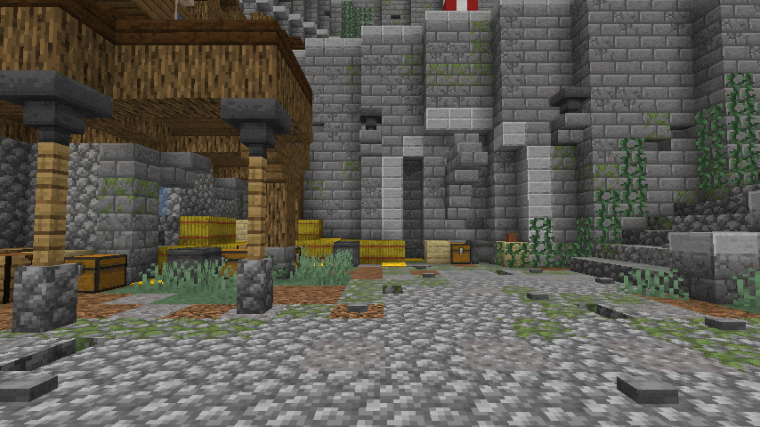

# GlowingEntities


An util to easily set glowing entities (or blocks) per-player on a Spigot server.

No ProtocolLib, no dependency, compatible from Minecraft 1.17 to 1.21!




## How to install?
Add this requirement to your maven `pom.xml` file:

```xml
<dependency>
  <groupId>fr.skytasul</groupId>
  <artifactId>glowingentities</artifactId>
  <version>{VERSION}</version>
  <scope>compile</scope>
</dependency>
```
Then, configure the maven shade plugin to relocate the classes location. You can also use the Spigot library resolver to download the library, or Paper's plugin loader.

> [!NOTE]  
> Until 1.3.4, the util was under the groupId `io.github.skytasul`.  
> After 1.3.5, it has changed to `fr.skytasul`.

## How to use?
### Make entities glow
1. Initialize the `GlowingEntities` object somewhere where you can easily get it, using `new GlowingEntities(plugin)`.
It is not recommended to create multiple `GlowingEntities` instances!

2. Use `GlowingEntities#setGlowing(Entity entity, Player receiver, ChatColor color)` to make an entity glow a color for a player!

3. You can change its glowing color by reusing the same method but changing the `color` parameter.

4. If you no longer wants your entity to glow, use `GlowingEntities#unsetGlowing(Entity entity, Player receiver)`.

5. When you are completely done with the glowing API (for instance, when your plugin is shutting down), remember to use `GlowingEntities#disable()`.

### Make blocks glow
The same as before but with the `GlowingBlocks` class :)

> **Warning**
> The `GlowingBlocks` util can only be used on Paper-based servers, not Bukkit or Spigot ones!